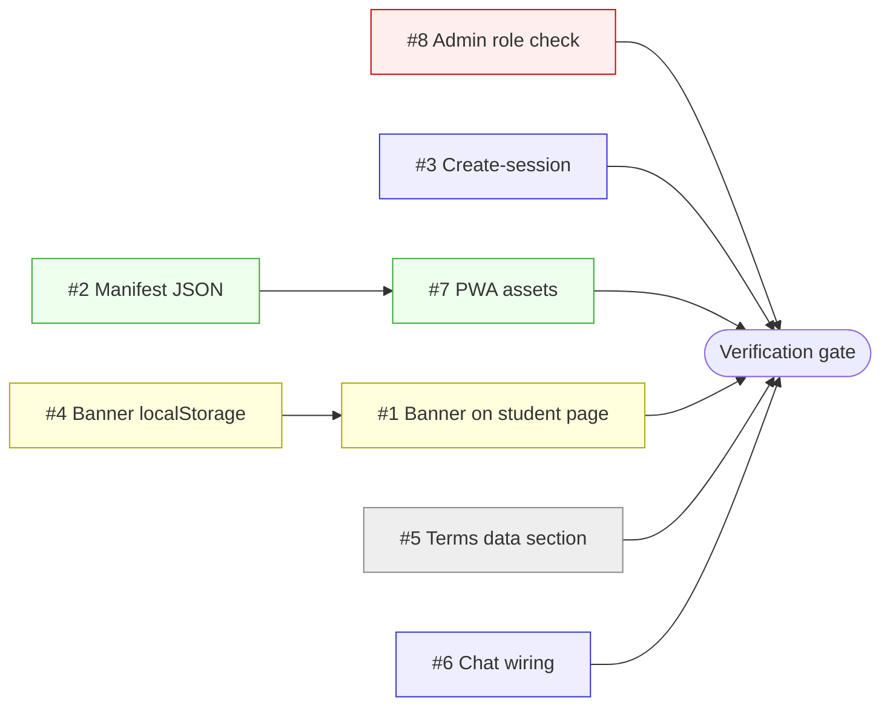

# Hitaishi — Remaining Work Plan

**Project:** Hitaishi mentorship app (`G:\iit\hitaishi`)
**Stack:** Next.js 14.2.18 + Drizzle ORM + PostgreSQL (Supabase) + Jitsi Meet
**Date:** 2026-06-04
**Scope:** 8 actionable issues from the 4-phase audit. Issues #9 (Jitsi vs Google Meet) and #10 (`feedbackTemplateId` / `feedback_templates` dead code) are deferred per user decision. See §8.
**Related docs:** `REALTIME_CHAT_PLAN.md` (chat architecture reference), `REALTIME_CHAT_PLAN.md` §3–§5 (conversation model — read before tackling #6).

---

# Hitaishi — Remaining Work Distribution Plan
*8 actionable issues from the 4-phase audit. Issues #9 (Jitsi decision) and #10 (feedback template dead code) are deferred per user.*

---

## 1. Priority Order

| Rank | # | Issue | Why this rank |
|------|---|-------|---------------|
| 1 | **#8** | Admin role check on `/api/admin/sessions/[id]/observe` | **Security-first.** Privilege escalation in production. Single-file fix; highest risk-to-effort ratio. |
| 2 | **#3** | Create-session modal + API `TODO(phase-5)` | **Demo blocker.** Mentors cannot actually create sessions. Largest functional gap. |
| 3 | **#2** | Malformed `manifest.json` | **PWA broken in 5 min.** Trivial JSON fix; unblocks install validation for #7. |
| 4 | **#7** | Missing PWA assets (logo + 192/512 icons) | Required for #2 to be meaningful (PWA install needs both manifest + icons). |
| 5 | **#4** | Banner `useState` → `localStorage` | UX regression (banner reappears on refresh) and **prerequisite for #1** to be coherent. |
| 6 | **#1** | Add `PrivacyNoticeBanner` to student sessions page | UI consistency; depends on #4. |
| 7 | **#5** | Terms "Data handling" section | Legal hygiene, low urgency, low effort. |
| 8 | **#6** | Chat sidebar → wire to `messages` table | Largest remaining feature, but not a security or demo blocker. |

**Rationale:** security → functional correctness → quick infrastructure wins → UX polish → content → feature wiring. #8 first because it's a single-route privilege escalation that could be exploited today. #3 next because every other audit phase assumes sessions can be created. #2/#7 together restore PWA. #4 then #1 because they touch the same component and #4 must land first to avoid reworking #1.

---

## 2. Parallel Execution Lanes

| Lane | Name | Issues | Required capabilities | Why parallel-safe |
|------|------|--------|-----------------------|-------------------|
| **A** | **Security + Backend** | #8, #3 (API half) | `backend-developer`, `security-review` | #8 is single route handler; #3 API lives in `app/api/mentor/sessions/create/route.ts`. No shared files with other lanes. |
| **B** | **PWA Bundle** | #2, #7 | `general` + asset tooling (sharp / rsvg / favicon generator) | Both touch only `public/*`; no app code, no schema. |
| **C** | **Frontend Polish** | #4 → #1 (sequential), #5 | `frontend-developer` | Banner work is contained to `components/PrivacyNoticeBanner.tsx` + 1 page; #5 is static copy in `app/terms/page.tsx`. |
| **D** | **Realtime Chat** | #6 | `backend-developer` + `frontend-developer` (full-stack) | Touches `app/session/[sessionId]/SessionRoomClient.tsx` and (likely) adds a session-scoped conversation resolver under `app/api/chat/*` or a new endpoint. Isolated from other lanes. |

**4 lanes = 4 parallel workers** if available. Minimum staffing: 1 senior (Lane A) + 1 parallel agent (rotate through B/C/D).

---

## 3. Dependency Graph

**Critical path:** `#8 → #3 → Verification` (longest by effort; #3 is the L-sized task).
**Parallelizable without blocking:** #2/#7 (PWA), #4/#1 (banner), #5 (legal), #6 (chat) — all can finish independently before the verification gate.

---

## 4. Per-Issue Breakdown

### #1 — Add `PrivacyNoticeBanner` to student sessions page
- **Scope:** Render `<PrivacyNoticeBanner />` on `app/student/sessions/page.tsx` to match mentor counterpart.
- **Files:** `app/student/sessions/page.tsx` (add import + JSX near top of return). Reference `app/mentor/sessions/page.tsx` for placement.
- **Acceptance:**
  - Banner appears on first visit to `/student/sessions` for non-dismissed users.
  - Dismissed state persists across refresh (depends on #4).
  - No hydration warnings in console.
- **Verification:** `npm run build` clean; manual refresh after dismiss shows banner gone; `view-source` on the page shows the component.
- **Effort:** **S** (15 min)
- **Owner:** `frontend-developer`

### #2 — Fix malformed `public/manifest.json`
- **Scope:** Trailing `]}` outside the JSON object breaks `manifest` parse and PWA install on Chrome/Edge.
- **Files:** `public/manifest.json` (read raw, strip trailing junk, validate).
- **Acceptance:**
  - `node -e "JSON.parse(require('fs').readFileSync('public/manifest.json','utf8'))"` exits 0.
  - `npm run build` reports no manifest warning.
  - Lighthouse "Installable" passes after #7 lands.
- **Verification:** JSON parse CLI; DevTools → Application → Manifest shows no error.
- **Effort:** **S** (5–10 min)
- **Owner:** `general`

### #3 — Create-session modal: student/cohort picker + `sessionParticipants` insert
- **Scope:** Replace `TODO(phase-5)` in the create-session API with real `sessionParticipants` inserts; add a student (and optional cohort) picker to the mentor modal.
- **Files:**
  - `app/mentor/sessions/SessionsClient.tsx:296-358` — add picker UI; selected student IDs into form state; submit payload.
  - `app/api/mentor/sessions/create/route.ts:47` — resolve student IDs, insert one `sessionParticipants` row per student, wrap in the same transaction as the session insert.
  - *(Read-only)* `db/schema/index.ts` → `mentorship.sessionParticipants` to confirm columns (`sessionId`, `userId`, `role`).
  - *(Optional)* `app/mentor/sessions/page.tsx` server fetch to pre-load students for the picker.
- **Acceptance:**
  - Mentor can open modal, select ≥1 student, click Create, see the session appear in their list.
  - Selected student(s) see the session in `app/student/sessions/page.tsx`.
  - `psql` / Supabase dashboard shows matching `sessionParticipants` rows.
  - No 500s in network tab; no FK violations.
- **Verification:** `npm run typecheck`; manual create as `mentor@demo.hitaishi.app` → confirm visibility as `student@demo.hitaishi.app`; `select count(*) from mentorship.session_participants` increases by N for an N-student session.
- **Effort:** **L** (1.5–2 hr)
- **Owner:** `general` / full-stack (UI + API + DB)

### #4 — `PrivacyNoticeBanner`: `useState` → `localStorage`
- **Scope:** Persist dismissal in `localStorage` so the banner doesn't reappear on refresh.
- **Files:** `components/PrivacyNoticeBanner.tsx`
- **Acceptance:**
  - Initial state reads from `localStorage` only inside a `useEffect` (no SSR mismatch).
  - On dismiss, writes `hitaishi-privacy-notice-dismissed: "true"` (or versioned key).
  - Refresh → banner stays hidden; clearing the key (or localStorage) → banner reappears.
  - No `ReferenceError: window is not defined` during `npm run build`.
- **Verification:** Refresh after dismiss; inspect Application → Local Storage; `npm run build` clean.
- **Effort:** **S** (15–20 min)
- **Owner:** `frontend-developer`

### #5 — Add "Data handling" section to Terms
- **Scope:** New section in `app/terms/page.tsx` covering storage, encryption, retention, no-sale.
- **Files:** `app/terms/page.tsx` (add a `<section>` between current sections).
- **Acceptance:**
  - Section covers: where data is stored (Supabase/Postgres region), encryption (TLS in transit, AES-256 at rest — confirm with Supabase docs), no third-party sale, retention window, deletion on account closure.
  - Renders responsively; matches existing typography.
- **Verification:** Visual review at `/terms`; copy-paste the section title into search to confirm it's findable.
- **Effort:** **S** (20–30 min; mostly drafting)
- **Owner:** `general`

### #6 — Wire chat sidebar to `messages` table
- **Scope:** The `SessionRoomClient.tsx` chat panel is currently a UI placeholder. Connect it to the existing chat infrastructure so mentor + students can exchange messages tied to the session.
- **Files:**
  - `app/session/[sessionId]/SessionRoomClient.tsx` — replace placeholder send/append logic with calls to the messages API; subscribe via `lib/realtime/client.ts`.
  - *(Likely new)* `app/api/chat/session/[sessionId]/messages/route.ts` (or extend `lib/messages.ts`) to resolve a session-scoped conversation and enforce participant auth.
  - *(Read-only)* `lib/messages.ts`, `app/api/chat/conversations/[id]/messages/route.ts`, `REALTIME_CHAT_PLAN.md` §4 (conversation model) to confirm pattern.
- **Acceptance:**
  - Mentor + student in the same session can send messages; both see them in <1s.
  - Non-participant users cannot read/write (403).
  - On refresh, message history is fetched and rendered.
  - Realtime subscription cleans up on unmount (no leaked listeners).
- **Verification:** Two browser profiles (mentor + student demo accounts) in same session URL; exchange messages; confirm DB rows in `chat.messages`; `npm run typecheck` and `npm run build` clean.
- **Effort:** **L** (1–1.5 hr)
- **Owner:** full-stack (Lane D) — `backend-developer` for the endpoint + `frontend-developer` for the wiring.

### #7 — Generate PWA assets
- **Scope:** Provide logo SVG and 192/512 PNG icons so the manifest is meaningful and Chrome offers install.
- **Files:**
  - `public/hitaishi-logo.svg` (new; brand mark, square, simple).
  - `public/icon-192.png` (new).
  - `public/icon-512.png` (new, must include a `purpose: "maskable"` 512 variant if using maskable — confirm manifest intent).
  - *(Optional)* `public/apple-touch-icon.png`.
- **Acceptance:**
  - All three files exist; PNGs are exactly 192×192 and 512×512; SVG renders in a browser.
  - `manifest.json` references resolve.
  - Lighthouse "PWA installable" passes.
- **Verification:** Lighthouse PWA audit; DevTools → Application → Manifest shows icons rendered; on mobile/Chrome the install prompt appears.
- **Effort:** **M** (30 min, including asset generation)
- **Owner:** `general`

### #8 — Admin role check on observe route
- **Scope:** The `/api/admin/sessions/[id]/observe` route is admin-scoped by URL but not by code. Any authenticated user can hit it.
- **Files:** `app/api/admin/sessions/[id]/observe/route.ts` (top of handler).
- **Acceptance:**
  - First lines of the handler verify `session.user.role === 'admin'` (or `app_metadata.role === 'admin'`, depending on the project's auth shape — check `lib/auth/*` or similar for the canonical check).
  - Returns 401 for unauthenticated, 403 for non-admin, 200 only for admin.
  - Server logs no PII for non-admin attempts (just status code).
- **Verification:** Three curl/Postman calls with mentor token (expect 403), unauthenticated (expect 401), admin token (expect 200); `npm run typecheck` and `npm run build` clean.
- **Effort:** **S** (15 min)
- **Owner:** `backend-developer` (with `security-review` as reviewer)

---

## 5. Risk Analysis

| Lane | Risk | Mitigation |
|------|------|------------|
| **A — Security + Backend** | **#8:** Picking the wrong role-claim path (e.g. checking `user_metadata.role`, which is user-editable in Supabase) leaves the hole open. | Read `lib/auth/*` or an existing admin route to find the canonical `role` check. Prefer `session.user.app_metadata.role` or a server-side `profiles` lookup. |
| **A — Security + Backend** | **#3:** `sessionParticipants` schema may have additional required columns (e.g. `joinedAt`, `invitedBy`) not visible at the `TODO` line; a naive insert throws 500. | Open `db/schema/index.ts` for `sessionParticipants` before writing the insert; generate a Drizzle `db.insert(...).values(...)` with all `NOT NULL` columns. Run a `dry: true` migration check. |
| **B — PWA** | **#2/#7:** Manifest references icons that don't exist (or vice versa) — Lighthouse still reports "installable = false" with a confusing error. | After #2 and #7, re-run manifest parse + check DevTools Application tab for missing/404'd icons. |
| **C — Frontend** | **#4:** SSR hydration mismatch if `useState` initializer reads `localStorage` directly. | Initialize from a constant (`false`); read `localStorage` inside `useEffect`; only render banner when not yet hydrated-acknowledged. |
| **C — Frontend** | **#1:** After fixing #4, the new student-page banner might conflict with a future student-layout banner — duplicate copy on screen. | Search repo for other banner placements before adding; decide whether the page or layout is the right home (page is fine for now, document the choice). |
| **D — Realtime Chat** | **#6:** The existing `conversations` model is 1:1 user-to-user; sessions are 1:many. Adapting it requires either a new conversation type or a session-keyed channel. | Read `REALTIME_CHAT_PLAN.md` §3-§5 first. Decide: (a) `conversation.type = 'session'` extension, or (b) separate `session_messages` table mirroring `messages`. Option (a) is less code; option (b) is cleaner long-term. Document the choice in a code comment. |
| **D — Realtime Chat** | **#6:** Realtime subscription leaks if the component unmounts mid-message. | Use the existing `useEffect` cleanup pattern in `lib/realtime/client.ts`; add a unit smoke check or manual unmount test. |

---

## 6. Recommended Sequencing

**Assumptions:** 1 senior dev (owns Lane A and final review) + 1 parallel generalist agent. ~6 working hours total.

### Block 0 — Triage & Setup (15 min)
- Senior: read `REALTIME_CHAT_PLAN.md` §3-§5, `db/schema/index.ts` (`sessionParticipants`, `messages`, `conversations`), and one existing admin route for the role-check pattern. Pin the answers in `REMAINING_WORK_PLAN.md` for the parallel agent.

### Block 1 — Parallel quick wins (Hour 1)
| Agent | Lane | Action | Commit |
|-------|------|--------|--------|
| Senior | A | #8 admin role check | `fix(security): gate /api/admin/sessions/[id]/observe behind admin role` |
| Generalist | B | #2 manifest JSON fix | `fix(pwa): repair malformed public/manifest.json` |
| Generalist | B | #7 generate PWA assets (logo.svg + icons) | `feat(pwa): add hitaishi logo and 192/512 icons` |
| Generalist | C | #4 banner localStorage | `fix(ux): persist PrivacyNoticeBanner dismissal in localStorage` |

### Block 2 — Continue parallel (Hour 2)
| Agent | Lane | Action | Commit |
|-------|------|--------|--------|
| Generalist | C | #1 add banner to student sessions | `feat(student): render PrivacyNoticeBanner on /student/sessions` |
| Generalist | C | #5 terms data-handling section | `docs(legal): add data-handling section to /terms` |
| Generalist | D | #6 chat wiring — endpoint + UI integration | `feat(session): wire session chat to messages table` |

### Block 3 — Functional work (Hours 3–4)
| Agent | Lane | Action | Commit |
|-------|------|--------|--------|
| Senior | A | #3 create-session modal + API | `feat(mentor): implement student picker and sessionParticipants insert` (split into 2 commits if cleaner: `feat(mentor): add student picker to create-session modal` then `feat(api): insert sessionParticipants on session create`) |

### Block 4 — Verification gate (Hour 5)
See §9.

**PR strategy:** One PR per commit, or group by lane (A → 2 PRs, B → 1 PR, C → 1 PR, D → 1 PR). Total: ~5 PRs.

---

## 7. Total Scope Summary

| # | Issue | Effort | Lane | Expected outcome |
|---|-------|--------|------|------------------|
| 1 | Banner on student page | S | C | UI parity with mentor |
| 2 | Manifest JSON | S | B | Manifest parses cleanly |
| 3 | Create-session modal + API | L | A | Mentors can create sessions with participants end-to-end |
| 4 | Banner localStorage | S | C | Dismissal persists across refresh |
| 5 | Terms data-handling | S | C | Legal section present |
| 6 | Chat wiring | L | D | Real-time session chat works |
| 7 | PWA assets | M | B | Installable PWA |
| 8 | Admin role check | S | A | Privilege escalation closed |

**Totals:** 2×L + 1×M + 5×S ≈ **5–6 hours** of focused work, parallelizable to ~3–4 hours with two agents. **Net outcome:** PWA installable, mentor can create real sessions with students, session room chat functional, security hole closed, banner UX fixed, terms legally tightened.

---

## 8. Deferred Items

- **#9 — Jitsi vs Google Meet decision.** *Rationale:* User explicitly deferred; current Jitsi implementation works for demo. Revisit after product validates the Jitsi UX with real mentors.
- **#10 — `feedbackTemplateId` + `feedback_templates` dead code.** *Rationale:* User chose to keep dormant rather than delete. No churn; flagged for a future cleanup pass once product direction on feedback is decided.

---

## 9. Verification Gate

Run **all** of the following before declaring done.

### Build & type
- [ ] `npm run typecheck` → 0 errors
- [ ] `npm run build` → 0 errors, no manifest/icon warnings
- [ ] `node -e "JSON.parse(require('fs').readFileSync('public/manifest.json','utf8'))"` → exits 0

### Security
- [ ] `curl` `/api/admin/sessions/<id>/observe` with mentor token → 403
- [ ] `curl` same with no token → 401
- [ ] `curl` same with admin token → 200

### Functional — Create session (#3)
- [ ] Log in as `mentor@demo.hitaishi.app` → create session with 1 student selected → success toast
- [ ] Log in as that student → session appears in `/student/sessions`
- [ ] Supabase SQL: `select * from mentorship.session_participants where session_id = '<id>';` returns the expected row
- [ ] No 5xx in server logs

### Real-time chat (#6)
- [ ] Two browsers (mentor + student) join same `/session/<id>` URL
- [ ] Each sends a message; both receive it in <2s
- [ ] Refresh → message history loads
- [ ] Third user (non-participant) hitting the endpoint gets 403
- [ ] Component unmount (navigate away) → no console errors, no leaked WS

### PWA (#2 + #7)
- [ ] Chrome DevTools → Application → Manifest shows name, icons, no errors
- [ ] Lighthouse → PWA category → "Installable" passes
- [ ] On Chrome desktop, address-bar install icon appears

### UX (#1 + #4)
- [ ] Visit `/student/sessions` → banner shows
- [ ] Click dismiss → banner disappears
- [ ] Refresh page → banner stays dismissed
- [ ] Clear `localStorage` key `hitaishi-privacy-notice-dismissed` → banner returns
- [ ] Same flow on `/mentor/sessions` still works (no regression)

### Legal (#5)
- [ ] `/terms` renders new "Data handling" section with subsections for storage, encryption, retention, no-sale
- [ ] No console errors; responsive at mobile widths

### Supabase dashboard
- [ ] `session_participants` table populating on mentor session create
- [ ] `messages` (or new session-messages) populating on chat send
- [ ] RLS policies not changed unintentionally (no surprise `service_role` writes)

### Final
- [ ] All commits pushed; PRs reviewed and merged
- [ ] `REMAINING_WORK_PLAN.md` updated with completion status per issue
- [ ] No new TODOs or `// FIXME` left in touched files

---

*End of plan. The follow-up general agent should write this content to `G:\iit\hitaishi\REMAINING_WORK_PLAN.md` with minimal reformatting, then proceed Block 1.*

---

## Footer

**Verification sign-off:** Completion requires every checkbox in §9 (Verification Gate) to pass, plus senior review of Lanes A and D.

**Related docs:**
- `G:\iit\hitaishi\REALTIME_CHAT_PLAN.md` — chat architecture, conversation model (§3–§5), realtime client patterns. Required reading for #6.
- `G:\iit\hitaishi\lib\session.ts` — `getCurrentUser()` / `requireRole()` helpers; canonical auth pattern for #8.
- `G:\iit\hitaishi\db\schema\index.ts` → `mentorship.sessionParticipants` — confirm columns before #3 insert.
- `G:\iit\hitaishi\lib\auth\*` — find canonical admin-role check before #8 implementation.

**Status legend:** ☐ open · ◐ in progress · ☑ complete · ✕ blocked / deferred
